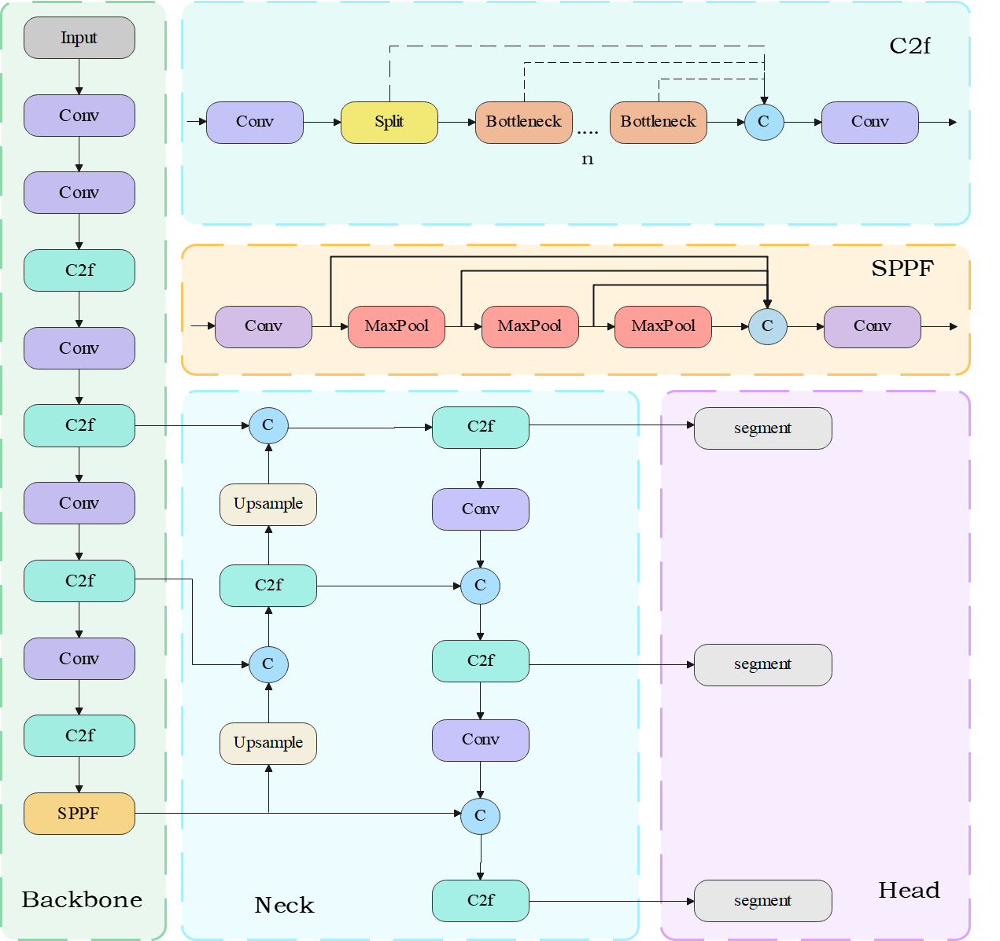

# YOLOv8实现缆索分割
### 一、问题描述
缆索是悬索桥的关键承载构件，其健康状况直接影响整个悬索桥的安全运行，需要定期对缆索受力状况进行监测。基于振动的缆索受力估算法因其简便性而经常被采用。该方法利用振动来估算缆索受力，必须确定缆索的动态参数（如振动和固有频率）。
本研究利用Yolov8模型实现缆索高分辨率语义分割，生成仅包含缆索的新图像，进而可以对缆索振动进行测算。
### 二、模型介绍
YOLOv8 模型是 Ultralytics 团队与众多贡献者们，在YOLO v5模型的框架基础上，吸收加入了众多优秀模块，改进了多个模型结构，而提出的一个实时多任务模型。它更进一步提高了模型性能和通用性，在边缘设备部署和工业应用方面的效果远远超过其他模型。 YOLOv8根据不同的架构规模进行划分，包括n、s、m、l、x五种规模，其中模型参数量和精度呈正相关关系。使用者可以根据不同的场景和计算能力要求选择合适的模型规模。YOLOv8模型的架构主要包括三大模块：Backbone主干网络、Neck瓶颈结构以及Head输出头。这些模块共同构成了整个模型的基础架构。



### 三、实现

#### 1、数据准备
对有限的图像进行增强，采用随机翻转、裁剪、多尺度变换和噪声干扰的随机组合来扩展数据集。得扩展后到总共15000张图片，将其按照8：2进行随机划分，12000张图片用于训练，3000用于验证。

#### 2、训练
设置输入图像大小为1080，模型训练100 epoch，分割损失如下。


#### 3、验证
在验证集上测试模型得到Mask Precision-Recall Curve


绘制mAP50和mAP50-95曲线


#### 4、分割结果


### 四、预测

```
#安装环境
pip install -r requirements.txt
```

runs/segment/data100n-1080/weights/best.pt为训练好的模型，100 epoch，预训练模型为yolov8n-seg.pt，输入图像尺寸为1080。

runs/segment/data200m/weights/best.pt为训练好的模型，200 epoch，预训练模型为yolov8m-seg.pt，输入图像尺寸为640。

运行main.py以预测

```
# 设置模型路径
model = YOLO("runs/segment/data100n-1080/weights/best.pt")   
```

```
# 设置分割图片路径
model.predict("assets/15_446.jpg, save=True, conf=0.8, show_conf=False, show_labels=False, show_boxes=False) 
``` 
